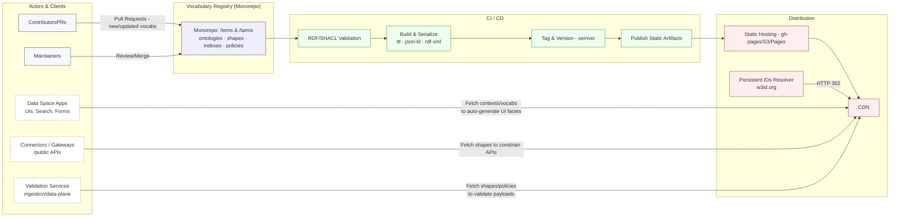
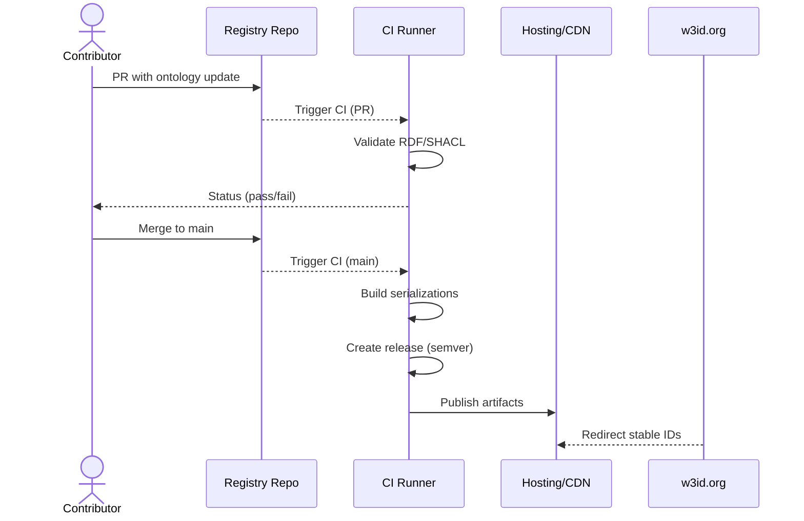

# Vocabulary Registry — First Iteration

This repository hosts the **Vocabulary Registry** for **TEMS** and **TAMIS**.

It provides:

- Sharing of **ontologies and vocabularies** (multi-serialization: TTL, JSON-LD, RDF/XML).
- Sharing of **TEMS-supported policies** and their shapes (e.g., ODRL + SHACL).
- Sharing of **shapes** to constrain APIs and generate UIs/facets.
- Automatic **validation, serialization, versioning, and publishing** via CI/CD.
- **Permanent URIs** (e.g., via w3id.org) for stability.

> GitHub renders Mermaid diagrams in **Discussions**, **Issues**, **PRs**, and **README.md**.

---

## 🔎 Discover assets

Pick a dataspace to browse all ontologies, shapes, indexes and policies:

- **TEMS** → [tems/](./tems/) · landing page: [tems/README.md](./tems/README.md)
- **TAMIS** → [tamis/](./tamis/) · landing page: [tamis/README.md](./tamis/README.md)

Each landing page is kept up-to-date by CI and lists:

- **Ontologies** (all versions, all serializations)
- **Shapes** (SHACL, etc.)
- **Indexes** (facets/search descriptors)
- **Policies** (ODRL, etc.)

## Architecture (Context)



---

## CI/CD Flow



---

## Folder Structure

```text
/tems
  /ontologies
    /core/Vx.x.x/*.ttl|.jsonld|.xml
  /indexes
    media-objects.jsonld
    3d-objects.jsonld
  /shapes
    media-objects.jsonld
    3d-objects.jsonld
  /policies
    eu.jsonld
    media.jsonld
/tamis
  /ontologies …
  /indexes …
  /shapes …
  /policies …
```

---

## Usage

- Put ontology sources in Turtle under `*/ontologies/*/Vx.y.z/*.ttl`.
- CI will:
  1) validate TTL syntax (Apache Jena **riot**),
  2) run **pySHACL** against shapes,
  3) serialize **.ttl** → **.jsonld** and **.rdf.xml** next to the source,
  4) (optional) create a semver release,
  5) publish `public/` to GitHub Pages.

---

## Local Dev

```bash
# Validate TTL
docker run --rm -v "$PWD":/work stain/jena riot --validate /work/tems/ontologies/core/V0.1.0/core.ttl

# Serialize (requires Apache Jena locally)
./scripts/serialize.sh
```
